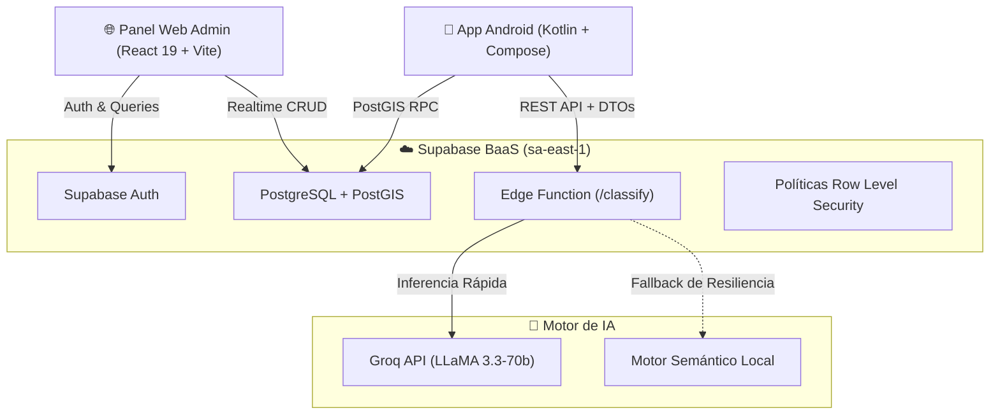

# EcoMapa V2.1 — Resumen Ejecutivo del Producto

**Versión:** 2.1.0 (Producción / Devoluciones Autoridades)  
**Stack Principal:** Android Nativo (Kotlin 2.0 + Jetpack Compose) · Web Admin (React 19 + Vite) · Supabase (PostGIS + Edge Functions) · Groq (LLaMA 3.3-70b)

---

## 🌍 ¿De qué se trata?

**EcoMapa** es una plataforma integral de gestión ambiental y economía circular que conecta a **ciudadanos, municipios, recuperadores urbanos y empresas privadas**. 

Combina un **asistente de Inteligencia Artificial** para clasificación instantánea de residuos, un **mapa interactivo georreferenciado** con PostGIS, un sistema de **gamificación con canje de cupones reales (B2B)**, un canal de **retiros a domicilio para residuos voluminosos** y un módulo de **Responsabilidad Extendida del Productor (REP)** para marcas oficiales.

---

## 📱 Funcionalidades en la App Móvil (Ciudadanos)

| Módulo | Descripción |
|---|---|
| 🌿 **EcoAsistente (IA)** | Clasifica residuos en lenguaje natural, informa el impacto ambiental estimado y sugiere el punto de reciclaje más cercano con navegación a Google Maps. |
| 🗺️ **Mapa Georreferenciado** | Renderizado offline con `osmdroid`, marcadores por color y badges especiales para centros privados de compra ($/kg) y puntos oficiales REP. |
| 🎁 **Recompensas & Cupones (B2B)** | Marketplace donde los Ecopuntos ganados por reciclar se canjean por descuentos y vouchers reales en comercios y supermercados adheridos. |
| 🚛 **Retiros a Domicilio** | Formulario para solicitar recolección de muebles, escombros, chatarra o restos de poda en franjas horarias coordinadas con cuadrillas y cooperativas. |
| 🏆 **Colección de Insignias** | 6 logros desbloqueables con rachas basadas en días de calendario (`LocalDate`) y multiplicadores de puntuación. |

---

## 🌐 Panel Web Administrativo (SaaS B2G / B2B)

El panel web (`/dashboard`) cuenta con autenticación segura (`Supabase Auth`) y roles para municipios, empresas y superadministradores:

- 📊 **Overview:** Monitoreo en tiempo real de puntos aprobados, solicitudes pendientes y gráfico de altas semanales.
- 📈 **Métricas IA:** Telemetría de consultas ciudadanas, latencias de la Edge Function y categorías más demandadas (`ai_queries_log`).
- 🚛 **Retiros a Domicilio:** Tablero logístico para asignar cuadrillas de recolección y actualizar estados de retiro.
- 🎁 **Recompensas B2B:** Publicación y control de stock de cupones patrocinados por comercios aliados.
- 🏭 **Directorio REP:** Registro de fabricantes y empresas comprometidas con la trazabilidad de residuos peligrosos/especiales.
- 🛡️ **Aprobaciones:** Moderación ágil de puntos sugeridos por entidades y vecinos.
- 🏢 **Entidades & Tenants:** Gestión de suscripciones y configuración multi-tenant para municipios.

---

## 🏗️ Arquitectura Técnica



---

## 🚀 Cómo Iniciar en Desarrollo

### 🌐 Panel Web:
```bash
cd web
npm install
npm run dev
```
Acceso: `http://localhost:5173` (Login: `admin@ecomapa.org`)

### 📱 App Móvil Android:
Abrir la carpeta `/Movil` en Android Studio y presionar **Run ▶️** en el emulador o dispositivo físico.

---

*Documentación técnica actualizada para EcoMapa V2.1 — Romero Labs.*
